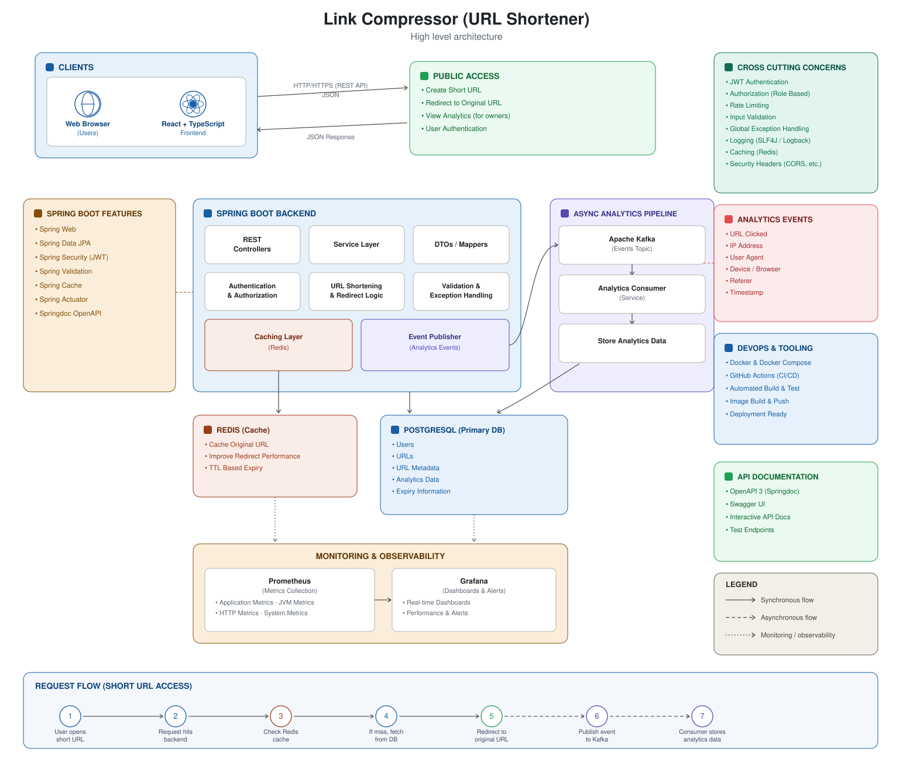

# 🔗 URL Shortener

A production-style, full-stack URL shortener with user accounts, click analytics, caching, async event processing, and monitoring — built with **Spring Boot 3 / Java 21** on the backend and **React + TypeScript (Vite)** on the frontend.

# 🔗 Link Compressor

A production-oriented full-stack URL shortening platform built with
Spring Boot and React, featuring JWT authentication, Redis caching,
Kafka-based asynchronous analytics, URL expiration, rate limiting,
and Prometheus/Grafana monitoring.

<p align="left">
  
  
  
  
  
  
  
  
  
</p>

**Live demo:** _add your deployed URL here once live_ · **API docs:** _add your Swagger URL here_

---

## Table of Contents

- [Features](#features)
- [Architecture](#architecture)
- [Tech Stack](#tech-stack)
- [Screenshots](#screenshots)
- [Getting Started](#getting-started)
  - [Run with Docker Compose (recommended)](#run-with-docker-compose-recommended)
  - [Run locally without Docker](#run-locally-without-docker)
- [Environment Variables](#environment-variables)
- [API Reference](#api-reference)
- [Project Structure](#project-structure)
- [Testing](#testing)
- [Monitoring](#monitoring)
- [Deployment](#deployment)
- [Roadmap](#roadmap)
- [License](#license)

---

## Features

- **Account-based short links** — register/login with JWT auth; every link is tied to an owner.
- **Fast redirects** — short codes resolve through a Redis cache before hitting Postgres.
- **Click analytics** — every redirect emits a Kafka event, consumed asynchronously and stored per-URL (device, browser, referrer, timestamp via [yauaa](https://github.com/nielsbasjes/yauaa) user-agent parsing) without slowing the redirect path down.
- **Expiring links** — URLs carry an expiry timestamp; a scheduled job (`UrlCleanupScheduler`) purges expired links automatically.
- **Rate limiting** — a request-level filter protects the API from abuse.
- **Ownership enforcement** — only the creator of a link can view its analytics or delete it.
- **API docs out of the box** — springdoc-openapi generates a live Swagger UI.
- **Observability** — Micrometer + Prometheus metrics, with a ready-to-use Grafana/Prometheus stack in Docker Compose.
- **Modern dashboard UI** — a React/TS frontend with a landing page, auth flows, a "my URLs" dashboard, and a per-link analytics view with charts.

## Architecture



- The **frontend** (React + Vite) talks to the API over HTTPS with a JWT bearer token.
- The **Spring Boot API** validates/authenticates requests (`JwtAuthenticationFilter`, `RateLimitFilter`), and reads/writes URLs through Postgres, using **Redis** as a read-through cache for short-code lookups.
- Every redirect publishes an `AnalyticsEvent` to **Kafka**; a separate consumer persists click analytics asynchronously so the redirect itself stays fast.
- A **scheduler** periodically deletes expired URLs.
- **Prometheus** scrapes `/actuator/prometheus`, and **Grafana** visualizes it.

## Tech Stack

**Backend:** Java 21 · Spring Boot 3.5 (Web, Security, Data JPA, Validation) · PostgreSQL · Redis · Apache Kafka · JJWT · springdoc-openapi (Swagger) · Micrometer/Prometheus · yauaa (user-agent parsing) · Lombok · JUnit/Mockito

**Frontend:** React 18 · TypeScript · Vite · React Router · TanStack Query · React Hook Form + Zod · Axios · Recharts · lucide-react

**Infra:** Docker & Docker Compose · Prometheus · Grafana · GitHub Actions (CI)

## Screenshots

> The UI covers a landing page, register/login, a "my URLs" dashboard, and a per-link analytics view with charts. Add real screenshots or a short GIF here once you run the app locally — this section is deliberately left as a template:
>
> ```md
> 
> 
> 
> ```
>
> Easiest way to capture them: run `docker compose up` + `cd frontend && npm run dev`, click through the app in your browser, and save screenshots (or a screen recording converted to GIF, e.g. with [Gifski](https://gif.ski/) or `ffmpeg`) into `docs/screenshots/`.

## Getting Started

### Prerequisites

- Docker & Docker Compose (easiest path), **or**
- Java 21, Maven, Node.js 18+, and local/hosted Postgres, Redis, and Kafka

### Run with Docker Compose (recommended)

```bash
git clone https://github.com/Arpitrawat18/url_shortner.git
cd url_shortner

cp .env.example .env
# edit .env and set POSTGRES_PASSWORD and JWT_SECRET (>= 32 random bytes)

# the app image expects a prebuilt jar, so build it first
./mvnw clean package -DskipTests

docker compose up --build
```

This starts: the API (`:8080`), PostgreSQL (`:5432`), Redis (`:6379`), Kafka (`:9092`), Prometheus (`:9090`), and Grafana (`:3000`).

Then, in a separate terminal, run the frontend:

```bash
cd frontend
npm install
npm run dev   # http://localhost:5173
```

Swagger UI: **http://localhost:8080/swagger-ui.html**

### Run locally without Docker

```bash
# 1. Backend — make sure Postgres, Redis, and Kafka are running locally,
#    and .env (or exported env vars) match your local ports.
./mvnw spring-boot:run

# 2. Frontend
cd frontend
npm install
npm run dev
```

## Environment Variables

Copy `.env.example` to `.env` and fill these in (never commit real secrets):

| Variable | Description | Example |
|---|---|---|
| `POSTGRES_DB` / `POSTGRES_USER` / `POSTGRES_PASSWORD` | Postgres container credentials | `url_shortener` / `postgres` / `••••` |
| `SPRING_DATASOURCE_URL` | JDBC URL used by the app | `jdbc:postgresql://localhost:5432/url_shortener` |
| `SPRING_DATASOURCE_USERNAME` / `SPRING_DATASOURCE_PASSWORD` | DB credentials for the app | |
| `SPRING_DATA_REDIS_HOST` / `SPRING_DATA_REDIS_PORT` | Redis connection | `localhost` / `6379` |
| `SPRING_KAFKA_BOOTSTRAP_SERVERS` | Kafka broker address | `localhost:9092` |
| `APP_BASE_URL` | Public base URL used to build short links | `http://localhost:8080` |
| `JWT_SECRET` | HS256 signing secret, **required**, ≥ 32 random bytes | generate with `openssl rand -base64 48` |

## API Reference

Full interactive docs live at `/swagger-ui.html` (OpenAPI spec at `/v3/api-docs`) once the app is running. Summary:

| Method | Endpoint | Auth | Description |
|---|---|---|---|
| `POST` | `/api/v1/auth/register` | Public | Create an account |
| `POST` | `/api/v1/auth/login` | Public | Log in, returns a JWT |
| `POST` | `/api/v1/url` | Public | Create a short URL |
| `GET` | `/api/v1/url/myurls` | 🔒 JWT | List the current user's URLs |
| `GET` | `/api/v1/url/{shortCode}` | Public | Redirect (302) to the original URL |
| `DELETE` | `/api/v1/url/{shortCode}` | 🔒 JWT (owner only) | Delete a URL |
| `GET` | `/api/v1/url/{shortCode}/analytics` | 🔒 JWT (owner only) | Click analytics for a URL |
| `GET` | `/{shortCode}` | Public | Root-level redirect shortcut |
| `GET` | `/actuator/health` | Public | Health check |
| `GET` | `/actuator/prometheus` | Public | Prometheus metrics |

## Project Structure

```
src/main/java/com/Project/URL_Shortner/
├── Config/          # Security, OpenAPI, Redis, Kafka, user-agent parsing config
├── Controller/       # Auth, Url, Redirect REST controllers
├── Dto/              # Request/response DTOs
├── Entities/          # JPA entities: User, Url, Analytics
├── Exception/         # Custom exceptions + global handler
├── Filters/           # JWT auth filter, rate-limit filter
├── Kafka/             # Producer, consumer, topic config, event model
├── Repository/        # Spring Data JPA repositories
├── Scheduler/          # Expired-URL cleanup job
├── Service/            # Business logic (Auth, Url, JWT, rate limiting)
└── Utils/               # Short code generator

frontend/src/
├── api/          # Axios instance + typed API calls
├── components/    # Reusable UI (forms, cards, badges, layout)
├── hooks/          # useAuth, etc.
├── pages/           # Landing, Login, Register, Dashboard, MyUrls, Analytics, Profile
└── styles/           # Global CSS
```

## Testing

```bash
./mvnw test
```

Covers auth service logic, JWT service, URL service (including ownership checks), Kafka config, and the global exception handler.

## Monitoring

Docker Compose includes Prometheus (`:9090`) scraping the app's `/actuator/prometheus` endpoint, and Grafana (`:3000`, default login `admin`/`admin`) for dashboards. Point Grafana at the Prometheus data source to visualize request rates, latencies, and JVM metrics.

## Deployment

There's no single "right" host for a stack with Postgres + Redis + Kafka, but a straightforward, low-cost path:

1. **Backend + Postgres + Redis:** [Railway](https://railway.app) or [Render](https://render.com) can host the Spring Boot API plus managed Postgres and Redis add-ons directly from this repo (they build the `Dockerfile`/jar for you). Set the same environment variables listed above in the platform's dashboard, including a real `JWT_SECRET`.
2. **Kafka:** for a low-effort deploy, use a managed Kafka (e.g. [Upstash Kafka](https://upstash.com/kafka) or [Confluent Cloud](https://www.confluent.io/confluent-cloud/)'s free tier) and point `SPRING_KAFKA_BOOTSTRAP_SERVERS` at it — self-hosting Kafka on a small free instance is usually more trouble than it's worth.
3. **Frontend:** deploy `frontend/` to [Vercel](https://vercel.com) or [Netlify](https://netlify.com) (`npm run build`, output in `frontend/dist`). Set the frontend's API base URL to your deployed backend URL, and add that frontend origin to `SecurityConfig`'s CORS allow-list.
4. **Monitoring (optional for a portfolio deploy):** Grafana Cloud's free tier can scrape a public `/actuator/prometheus` endpoint if you want live dashboards without hosting Prometheus/Grafana yourself.

Once live, update the **Live demo** and **API docs** links at the top of this README, and add the same two links to your resume/portfolio next to this project.

## Roadmap

- [ ] Custom/vanity short codes
- [ ] QR code generation per link
- [ ] Team/workspace sharing of links
- [ ] Bulk URL import

## License

MIT — see [`LICENSE`](LICENSE) for details.
